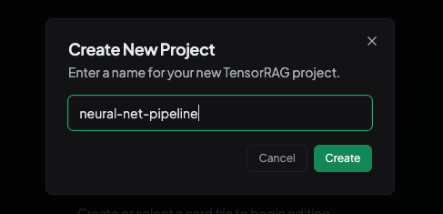
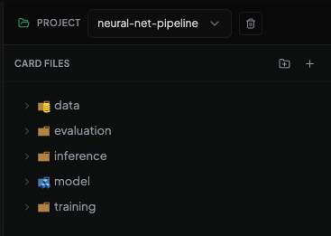
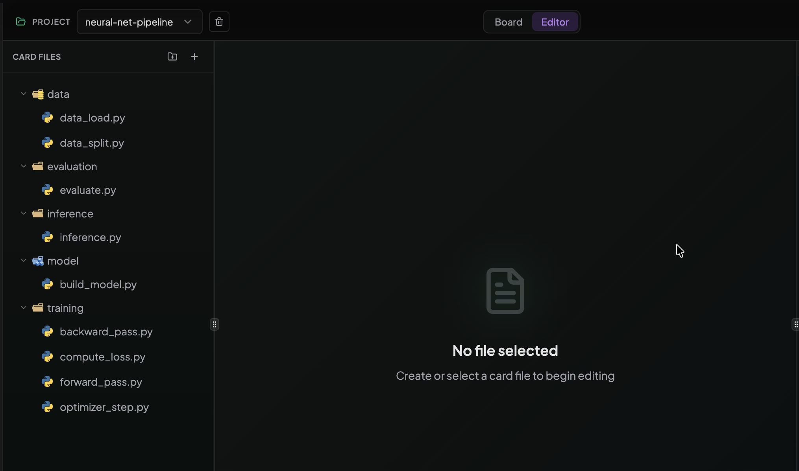
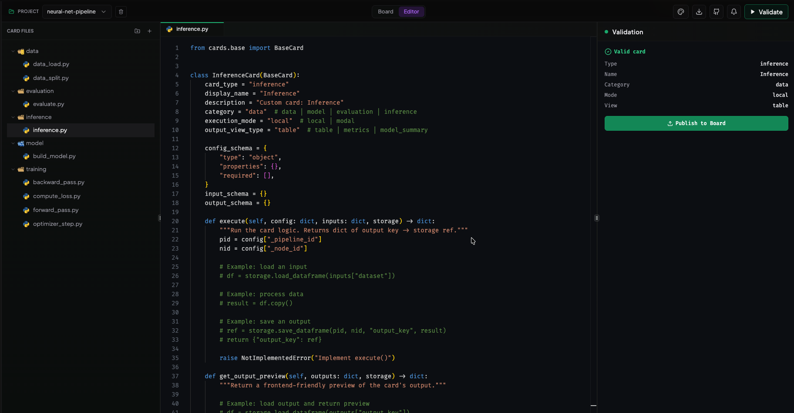
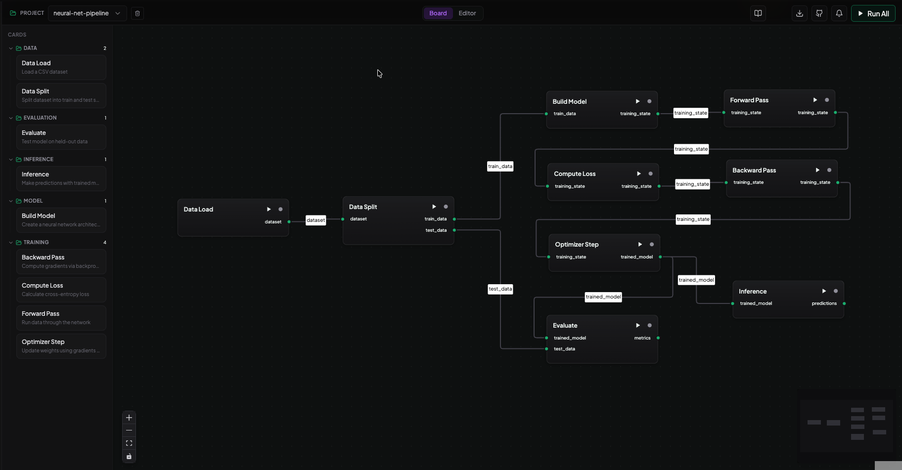
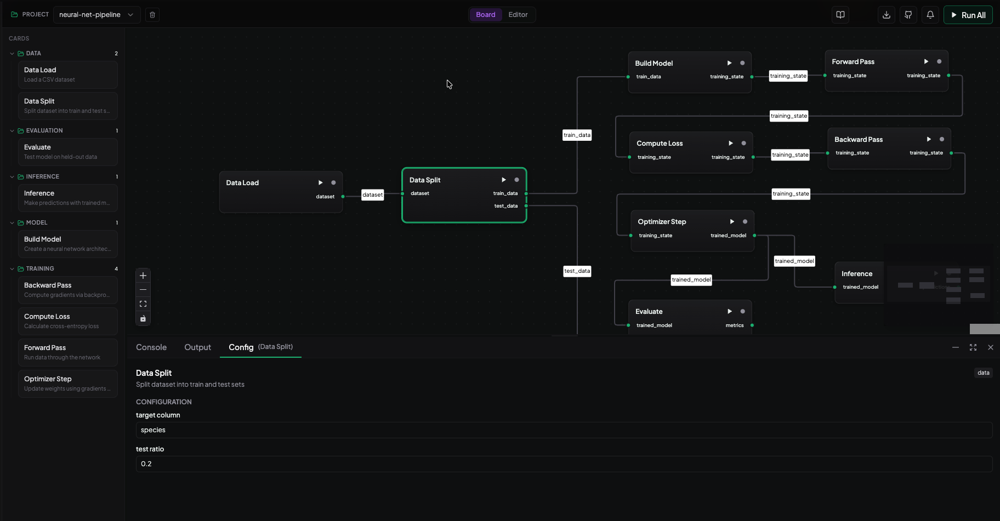
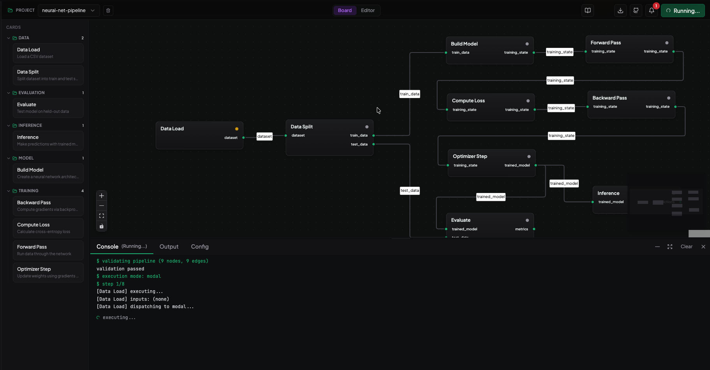
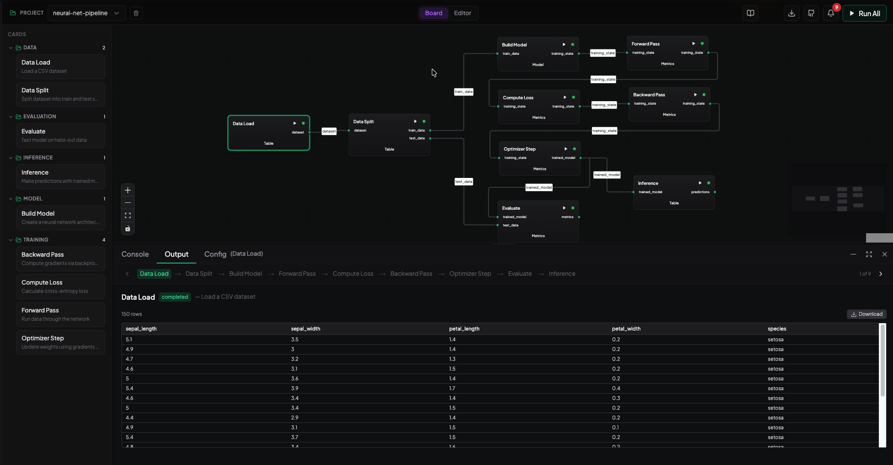

# TensorRAG — Getting Started Guide

> Learn how to build a complete neural network training pipeline from scratch using the **neural-net-pipeline** demo project.


## 1. Creating a Project

Switch to the **Editor** view using the toggle in the header bar.

In the left sidebar, click the **Project** dropdown and select **"+ New Project"**. Name it `neural-net-pipeline`.

Create 5 folders using the **folder icon** (top-right of the Card Files panel):

- `data`
- `model`
- `training`
- `evaluation`
- `inference`

Then create card files inside each folder — click a folder to select it, then click the **+** button to create a new card.

| Folder | Enter name | Creates file |
|--------|-----------|--------------|
| `data` | `data_load` | `data/data_load.py` |
| `data` | `data_split` | `data/data_split.py` |
| `model` | `build_model` | `model/build_model.py` |
| `training` | `forward_pass` | `training/forward_pass.py` |
| `training` | `compute_loss` | `training/compute_loss.py` |
| `training` | `backward_pass` | `training/backward_pass.py` |
| `training` | `optimizer_step` | `training/optimizer_step.py` |
| `evaluation` | `evaluate` | `evaluation/evaluate.py` |
| `inference` | `inference` | `inference/inference.py` |

<!-- SCREENSHOT: Editor view — project selector open, folders visible in sidebar -->

<div style="display:flex; gap:5px;">
  
  
</div>

## 2. Project Structure

Your project should have the following file tree. Each `.py` file is one pipeline card, organized by stage:

<!-- SCREENSHOT: File tree in the Editor sidebar showing all 9 cards in their folders -->



## 3. Writing Card Code

Click each file in the sidebar to open it in the code editor. Replace the default template with the card code shown below.

Every card extends `BaseCard` and defines:
- **card_type** — unique identifier
- **display_name** — label shown on the canvas
- **config_schema** — user-tunable parameters (appear in the config panel)
- **input_schema** / **output_schema** — typed data flowing in and out
- **execute()** — the actual processing logic

After pasting the code, click **"Validate"** in the header to check for errors, then click **"Publish to Board"** to register the card in your project.

<!-- SCREENSHOT: Editor with card code visible and Validate button highlighted in header -->



### Card 1: Data Load

**File:** `data/data_load.py`

Loads a CSV dataset from a URL or local path.

```python
from cards.base import BaseCard
import pandas as pd

class DataLoadCard(BaseCard):
    card_type = "data_load"
    display_name = "Data Load"
    description = "Load a CSV dataset"
    category = "data"
    execution_mode = "local"
    output_view_type = "table"

    config_schema = {
        "source_url": {
            "type": "string",
            "label": "CSV URL or path",
            "default": "https://raw.githubusercontent.com/mwaskom/seaborn-data/master/iris.csv"
        }
    }
    input_schema = {}
    output_schema = {"dataset": "dataframe"}

    def execute(self, config, inputs, storage):
        df = pd.read_csv(config["source_url"])
        ref = storage.save_dataframe("_p", "_n", "dataset", df)
        return {"dataset": ref}

    def get_output_preview(self, outputs, storage):
        df = storage.load_dataframe(outputs["dataset"])
        return {
            "columns": list(df.columns),
            "rows": df.head(20).values.tolist(),
            "total_rows": len(df),
        }
```

**Config:** `source_url` — URL to any CSV file (default: Iris dataset).


### Card 2: Data Split

**File:** `data/data_split.py`

Splits the dataset into train/test sets and separates features (X) from target (y). String labels are automatically encoded to integers.

```python
from cards.base import BaseCard
import pandas as pd
import numpy as np

class DataSplitCard(BaseCard):
    card_type = "data_split"
    display_name = "Data Split"
    description = "Split dataset into train and test sets"
    category = "data"
    execution_mode = "local"
    output_view_type = "table"

    config_schema = {
        "target_column": {
            "type": "string",
            "label": "Target column name",
            "default": "species"
        },
        "test_ratio": {
            "type": "number",
            "label": "Test set ratio",
            "default": 0.2
        }
    }
    input_schema = {"dataset": "dataframe"}
    output_schema = {"train_data": "json", "test_data": "json"}

    def execute(self, config, inputs, storage):
        df = storage.load_dataframe(inputs["dataset"])
        target = config["target_column"]
        ratio = float(config.get("test_ratio", 0.2))

        # Encode string labels to integers
        if df[target].dtype == object:
            labels = sorted(df[target].unique().tolist())
            label_map = {l: i for i, l in enumerate(labels)}
            df[target] = df[target].map(label_map)

        # Shuffle and split
        df = df.sample(frac=1, random_state=42).reset_index(drop=True)
        split = int(len(df) * (1 - ratio))

        X = df.drop(columns=[target]).values.astype(float)
        y = df[target].values.astype(float)

        train = {"X": X[:split].tolist(), "y": y[:split].tolist(),
                 "feature_names": [c for c in df.columns if c != target],
                 "num_features": X.shape[1],
                 "num_classes": int(y.max()) + 1}
        test  = {"X": X[split:].tolist(), "y": y[split:].tolist(),
                 "feature_names": train["feature_names"],
                 "num_features": train["num_features"],
                 "num_classes": train["num_classes"]}

        ref_train = storage.save_json("_p", "_n", "train_data", train)
        ref_test  = storage.save_json("_p", "_n", "test_data", test)
        return {"train_data": ref_train, "test_data": ref_test}

    def get_output_preview(self, outputs, storage):
        train = storage.load_json(outputs["train_data"])
        test  = storage.load_json(outputs["test_data"])
        return {
            "columns": ["split", "samples", "features", "classes"],
            "rows": [
                ["Train", len(train["y"]), train["num_features"], train["num_classes"]],
                ["Test",  len(test["y"]),  test["num_features"],  test["num_classes"]],
            ],
            "total_rows": 2,
        }
```

**Config:** `target_column` — the label column (default: `species`); `test_ratio` — fraction held out (default: `0.2`).


### Card 3: Build Model

**File:** `model/build_model.py`

Creates a PyTorch neural network (Sequential) and initializes the Adam optimizer. Architecture is defined by the number of input features, hidden layer sizes, and output classes.

```python
from cards.base import BaseCard
import torch
import torch.nn as nn
import numpy as np

def _make_model(arch):
    """Build a Sequential model from arch list, e.g. [4, 16, 3]."""
    layers = []
    for i in range(len(arch) - 1):
        layers.append(nn.Linear(arch[i], arch[i + 1]))
        if i < len(arch) - 2:
            layers.append(nn.ReLU())
    return nn.Sequential(*layers)

class BuildModelCard(BaseCard):
    card_type = "build_model"
    display_name = "Build Model"
    description = "Create a neural network architecture"
    category = "model"
    execution_mode = "local"
    output_view_type = "model_summary"

    config_schema = {
        "hidden_sizes": {
            "type": "string",
            "label": "Hidden layer sizes (comma-separated)",
            "default": "16,8"
        },
        "learning_rate": {
            "type": "number",
            "label": "Learning rate",
            "default": 0.01
        }
    }
    input_schema = {"train_data": "json"}
    output_schema = {"training_state": "json"}

    def execute(self, config, inputs, storage):
        train = storage.load_json(inputs["train_data"])
        n_features = train["num_features"]
        n_classes  = train["num_classes"]
        hidden = [int(h.strip()) for h in config["hidden_sizes"].split(",")]
        lr = float(config.get("learning_rate", 0.01))

        arch = [n_features] + hidden + [n_classes]
        model = _make_model(arch)
        optimizer = torch.optim.Adam(model.parameters(), lr=lr)

        state = {
            "model_state_dict": {k: v.tolist() for k, v in model.state_dict().items()},
            "optimizer_state_dict": None,
            "arch": arch,
            "lr": lr,
            "X": train["X"],
            "y": train["y"],
        }
        ref = storage.save_json("_p", "_n", "training_state", state)
        return {"training_state": ref}

    def get_output_preview(self, outputs, storage):
        state = storage.load_json(outputs["training_state"])
        arch = state["arch"]
        total = sum(arch[i] * arch[i+1] + arch[i+1] for i in range(len(arch)-1))
        return {
            "architecture": " -> ".join(str(a) for a in arch),
            "total_parameters": total,
            "learning_rate": state["lr"],
        }
```

**Config:** `hidden_sizes` — comma-separated layer widths (default: `"16,8"`); `learning_rate` (default: `0.01`).


### Card 4: Forward Pass

**File:** `training/forward_pass.py`

Runs input data through the network to produce raw predictions (logits). The model is rebuilt from the serialized state dict.

```python
from cards.base import BaseCard
import torch
import torch.nn as nn
import numpy as np

def _make_model(arch):
    layers = []
    for i in range(len(arch) - 1):
        layers.append(nn.Linear(arch[i], arch[i + 1]))
        if i < len(arch) - 2:
            layers.append(nn.ReLU())
    return nn.Sequential(*layers)

class ForwardPassCard(BaseCard):
    card_type = "forward_pass"
    display_name = "Forward Pass"
    description = "Run data through the network"
    category = "training"
    execution_mode = "local"
    output_view_type = "metrics"

    config_schema = {}
    input_schema = {"training_state": "json"}
    output_schema = {"training_state": "json"}

    def execute(self, config, inputs, storage):
        state = storage.load_json(inputs["training_state"])
        arch = state["arch"]

        model = _make_model(arch)
        sd = {k: torch.tensor(v) for k, v in state["model_state_dict"].items()}
        model.load_state_dict(sd)
        model.train()

        X = torch.tensor(state["X"], dtype=torch.float32)
        logits = model(X)

        state["logits"] = logits.detach().tolist()
        ref = storage.save_json("_p", "_n", "training_state", state)
        return {"training_state": ref}

    def get_output_preview(self, outputs, storage):
        state = storage.load_json(outputs["training_state"])
        logits = state.get("logits", [])
        return {
            "batch_size": len(logits),
            "output_dim": len(logits[0]) if logits else 0,
            "status": "Forward pass complete",
        }
```

**Config:** None — this card takes training state as-is.


### Card 5: Compute Loss

**File:** `training/compute_loss.py`

Calculates cross-entropy loss between the predicted logits and the true labels.

```python
from cards.base import BaseCard
import torch
import torch.nn as nn
import numpy as np

class ComputeLossCard(BaseCard):
    card_type = "compute_loss"
    display_name = "Compute Loss"
    description = "Calculate cross-entropy loss"
    category = "training"
    execution_mode = "local"
    output_view_type = "metrics"

    config_schema = {}
    input_schema = {"training_state": "json"}
    output_schema = {"training_state": "json"}

    def execute(self, config, inputs, storage):
        state = storage.load_json(inputs["training_state"])

        logits = torch.tensor(state["logits"], dtype=torch.float32)
        y = torch.tensor(state["y"], dtype=torch.long)

        loss_fn = nn.CrossEntropyLoss()
        loss = loss_fn(logits, y)

        state["loss"] = loss.item()
        ref = storage.save_json("_p", "_n", "training_state", state)
        return {"training_state": ref}

    def get_output_preview(self, outputs, storage):
        state = storage.load_json(outputs["training_state"])
        return {
            "loss": round(state.get("loss", 0), 6),
            "status": "Loss computed",
        }
```

**Config:** None.

### Card 6: Backward Pass

**File:** `training/backward_pass.py`

Computes gradients via backpropagation. This card rebuilds the full computational graph (forward + loss) because PyTorch autograd graphs don't survive JSON serialization between cards.

```python
from cards.base import BaseCard
import torch
import torch.nn as nn
import numpy as np

def _make_model(arch):
    layers = []
    for i in range(len(arch) - 1):
        layers.append(nn.Linear(arch[i], arch[i + 1]))
        if i < len(arch) - 2:
            layers.append(nn.ReLU())
    return nn.Sequential(*layers)

class BackwardPassCard(BaseCard):
    card_type = "backward_pass"
    display_name = "Backward Pass"
    description = "Compute gradients via backpropagation"
    category = "training"
    execution_mode = "local"
    output_view_type = "metrics"

    config_schema = {}
    input_schema = {"training_state": "json"}
    output_schema = {"training_state": "json"}

    def execute(self, config, inputs, storage):
        state = storage.load_json(inputs["training_state"])
        arch = state["arch"]

        # Rebuild model and computational graph
        model = _make_model(arch)
        sd = {k: torch.tensor(v) for k, v in state["model_state_dict"].items()}
        model.load_state_dict(sd)
        model.train()

        X = torch.tensor(state["X"], dtype=torch.float32)
        y = torch.tensor(state["y"], dtype=torch.long)

        # Forward + Loss (rebuild graph for autograd)
        logits = model(X)
        loss = nn.CrossEntropyLoss()(logits, y)

        # Backward
        loss.backward()

        # Save gradients with model state
        grads = {}
        for name, param in model.named_parameters():
            if param.grad is not None:
                grads[name] = param.grad.tolist()

        state["gradients"] = grads
        state["loss"] = loss.item()
        state["model_state_dict"] = {k: v.tolist() for k, v in model.state_dict().items()}

        ref = storage.save_json("_p", "_n", "training_state", state)
        return {"training_state": ref}

    def get_output_preview(self, outputs, storage):
        state = storage.load_json(outputs["training_state"])
        grads = state.get("gradients", {})
        grad_norms = {}
        for name, g in grads.items():
            t = torch.tensor(g)
            grad_norms[name] = round(t.norm().item(), 6)
        return {
            "loss": round(state.get("loss", 0), 6),
            "gradient_norms": grad_norms,
            "status": "Gradients computed",
        }
```

**Config:** None. Note: The graph rebuild is intentional — see "Key Design Decisions" at the end.


### Card 7: Optimizer Step

**File:** `training/optimizer_step.py`

Applies gradients to update model weights. Supports multiple epochs by looping the full forward-backward-step cycle internally. This is where the actual training happens.

```python
from cards.base import BaseCard
import torch
import torch.nn as nn
import numpy as np

def _make_model(arch):
    layers = []
    for i in range(len(arch) - 1):
        layers.append(nn.Linear(arch[i], arch[i + 1]))
        if i < len(arch) - 2:
            layers.append(nn.ReLU())
    return nn.Sequential(*layers)

class OptimizerStepCard(BaseCard):
    card_type = "optimizer_step"
    display_name = "Optimizer Step"
    description = "Update weights using gradients (multi-epoch)"
    category = "training"
    execution_mode = "local"
    output_view_type = "metrics"

    config_schema = {
        "epochs": {
            "type": "number",
            "label": "Number of epochs",
            "default": 50
        }
    }
    input_schema = {"training_state": "json"}
    output_schema = {"trained_model": "json"}

    def execute(self, config, inputs, storage):
        state = storage.load_json(inputs["training_state"])
        arch = state["arch"]
        lr = state["lr"]
        epochs = int(config.get("epochs", 50))

        model = _make_model(arch)
        sd = {k: torch.tensor(v) for k, v in state["model_state_dict"].items()}
        model.load_state_dict(sd)
        model.train()

        optimizer = torch.optim.Adam(model.parameters(), lr=lr)
        loss_fn = nn.CrossEntropyLoss()

        X = torch.tensor(state["X"], dtype=torch.float32)
        y = torch.tensor(state["y"], dtype=torch.long)

        history = []
        for epoch in range(epochs):
            optimizer.zero_grad()
            logits = model(X)
            loss = loss_fn(logits, y)
            loss.backward()
            optimizer.step()
            history.append(round(loss.item(), 6))

        trained = {
            "model_state_dict": {k: v.tolist() for k, v in model.state_dict().items()},
            "arch": arch,
            "lr": lr,
            "loss_history": history,
            "final_loss": history[-1],
        }
        ref = storage.save_json("_p", "_n", "trained_model", trained)
        return {"trained_model": ref}

    def get_output_preview(self, outputs, storage):
        data = storage.load_json(outputs["trained_model"])
        h = data.get("loss_history", [])
        return {
            "epochs": len(h),
            "initial_loss": h[0] if h else None,
            "final_loss": h[-1] if h else None,
            "status": "Training complete",
        }
```

**Config:** `epochs` — number of training iterations (default: `50`).


### Card 8: Evaluate

**File:** `evaluation/evaluate.py`

Tests the trained model on the held-out test set. Reports accuracy and test loss.

```python
from cards.base import BaseCard
import torch
import torch.nn as nn
import numpy as np

def _make_model(arch):
    layers = []
    for i in range(len(arch) - 1):
        layers.append(nn.Linear(arch[i], arch[i + 1]))
        if i < len(arch) - 2:
            layers.append(nn.ReLU())
    return nn.Sequential(*layers)

class EvaluateCard(BaseCard):
    card_type = "evaluate"
    display_name = "Evaluate"
    description = "Test model on held-out data"
    category = "evaluation"
    execution_mode = "local"
    output_view_type = "metrics"

    config_schema = {}
    input_schema = {"trained_model": "json", "test_data": "json"}
    output_schema = {"metrics": "json"}

    def execute(self, config, inputs, storage):
        trained = storage.load_json(inputs["trained_model"])
        test = storage.load_json(inputs["test_data"])

        model = _make_model(trained["arch"])
        sd = {k: torch.tensor(v) for k, v in trained["model_state_dict"].items()}
        model.load_state_dict(sd)
        model.eval()

        X = torch.tensor(test["X"], dtype=torch.float32)
        y_true = np.array(test["y"], dtype=int)

        with torch.no_grad():
            logits = model(X)
            loss = nn.CrossEntropyLoss()(logits, torch.tensor(test["y"], dtype=torch.long)).item()
            preds = logits.argmax(dim=1).numpy()

        accuracy = float((preds == y_true).mean())
        metrics = {
            "accuracy": round(accuracy, 4),
            "test_loss": round(loss, 6),
            "test_samples": len(y_true),
        }
        ref = storage.save_json("_p", "_n", "metrics", metrics)
        return {"metrics": ref}

    def get_output_preview(self, outputs, storage):
        return storage.load_json(outputs["metrics"])
```

**Config:** None. Receives both `trained_model` and `test_data` as inputs.

### Card 9: Inference

**File:** `inference/inference.py`

Makes predictions on new input data using the trained model. Outputs predicted class and probability distribution.

```python
from cards.base import BaseCard
import torch
import torch.nn as nn
import numpy as np

def _make_model(arch):
    layers = []
    for i in range(len(arch) - 1):
        layers.append(nn.Linear(arch[i], arch[i + 1]))
        if i < len(arch) - 2:
            layers.append(nn.ReLU())
    return nn.Sequential(*layers)

class InferenceCard(BaseCard):
    card_type = "inference"
    display_name = "Inference"
    description = "Make predictions with trained model"
    category = "inference"
    execution_mode = "local"
    output_view_type = "table"

    config_schema = {
        "input_values": {
            "type": "string",
            "label": "Input values (comma-separated)",
            "default": "5.1,3.5,1.4,0.2"
        }
    }
    input_schema = {"trained_model": "json"}
    output_schema = {"predictions": "json"}

    def execute(self, config, inputs, storage):
        trained = storage.load_json(inputs["trained_model"])

        model = _make_model(trained["arch"])
        sd = {k: torch.tensor(v) for k, v in trained["model_state_dict"].items()}
        model.load_state_dict(sd)
        model.eval()

        raw = config.get("input_values", "")
        values = [float(v.strip()) for v in raw.split(",")]
        X = torch.tensor([values], dtype=torch.float32)

        with torch.no_grad():
            logits = model(X)
            probs = torch.softmax(logits, dim=1)
            pred_class = logits.argmax(dim=1).item()

        result = {
            "input": values,
            "predicted_class": pred_class,
            "probabilities": probs[0].tolist(),
        }
        ref = storage.save_json("_p", "_n", "predictions", result)
        return {"predictions": ref}

    def get_output_preview(self, outputs, storage):
        result = storage.load_json(outputs["predictions"])
        probs = result.get("probabilities", [])
        rows = [[i, round(p, 4)] for i, p in enumerate(probs)]
        return {
            "columns": ["class", "probability"],
            "rows": rows,
            "total_rows": len(rows),
            "predicted_class": result.get("predicted_class"),
        }
```

**Config:** `input_values` — comma-separated feature values (default: `"5.1,3.5,1.4,0.2"` for Iris).


## 4. Building the Pipeline

Switch to the **Board** view. Select your project from the **Project** dropdown in the left sidebar.

Drag each card from the palette onto the canvas, roughly in order from left to right.

Connect them by dragging from an **output handle** (right side of a card) to the matching **input handle** (left side of the next card):

### Connection Table

| From | Output | → | To | Input |
|------|--------|---|-----|-------|
| Data Load | `dataset` | → | Data Split | `dataset` |
| Data Split | `train_data` | → | Build Model | `train_data` |
| Data Split | `test_data` | → | Evaluate | `test_data` |
| Build Model | `training_state` | → | Forward Pass | `training_state` |
| Forward Pass | `training_state` | → | Compute Loss | `training_state` |
| Compute Loss | `training_state` | → | Backward Pass | `training_state` |
| Backward Pass | `training_state` | → | Optimizer Step | `training_state` |
| Optimizer Step | `trained_model` | → | Evaluate | `trained_model` |
| Optimizer Step | `trained_model` | → | Inference | `trained_model` |

### Pipeline Flow

```
[Data Load] ──dataset──▸ [Data Split] ──train_data──▸ [Build Model] ──▸ [Forward Pass]
                              │                                              │
                              │                                       training_state
                              │                                              │
                              │                                              ▾
                              │                                       [Compute Loss]
                              │                                              │
                              │                                       training_state
                              │                                              │
                              │                                              ▾
                              │                                       [Backward Pass]
                              │                                              │
                              │                                       training_state
                              │                                              │
                              │                                              ▾
                              │                                       [Optimizer Step]
                              │                                          │         │
                              │                                   trained_model  trained_model
                              │                                          │         │
                              ├──test_data──▸ [Evaluate] ◂───────────────┘         │
                                                                                   │
                                              [Inference] ◂────────────────────────┘
```

<!-- SCREENSHOT: Board view with all 9 cards connected on the canvas -->


## 5. Configuring Cards

Click any card on the canvas to open its **configuration panel** on the right side.

Most cards have sensible defaults, but you can customize them:

| Card | Parameter | Default | Description |
|------|-----------|---------|-------------|
| Data Load | `source_url` | Iris CSV URL | URL to any CSV dataset |
| Data Split | `target_column` | `species` | Name of the label column |
| Data Split | `test_ratio` | `0.2` | Fraction held out for testing |
| Build Model | `hidden_sizes` | `16,8` | Comma-separated hidden layer widths |
| Build Model | `learning_rate` | `0.01` | Adam optimizer learning rate |
| Optimizer Step | `epochs` | `50` | Number of training iterations |
| Inference | `input_values` | `5.1,3.5,1.4,0.2` | Feature values for prediction |

<!-- SCREENSHOT: Config panel open on the right for the Build Model card -->



## 6. Running the Pipeline

Click the **"Run All"** button in the top-right of the header to execute the full pipeline.

**What happens:**

1. Cards execute in **topological order** — each card waits for its upstream inputs to finish before starting.
2. You'll see **real-time status badges** on each card:
   - **Pending** — waiting for upstream cards
   - **Running** — currently executing
   - **Completed** — finished successfully
   - **Failed** — error occurred (click to see details)
3. Click any **completed card** to preview its output:
   - Data Load → data table preview
   - Data Split → train/test split summary
   - Build Model → architecture and parameter count
   - Optimizer Step → loss history (initial → final)
   - Evaluate → accuracy and test loss
   - Inference → predicted class and probabilities

<!-- SCREENSHOT: Pipeline mid-execution with status badges visible on cards -->




Your pipeline canvas and all card files are **automatically saved** per-project. You can come back to this pipeline anytime by selecting the project from the dropdown.

## Key Design Decisions

- **state_dict serialization** — Model weights are stored as plain JSON lists (via `tensor.tolist()`), not pickled objects. This avoids class reference issues between separate card modules.
- **`_make_model()` helper** — Each card that needs the model defines its own `_make_model(arch)` function. This avoids cross-module import issues in the sandboxed executor.
- **Backward Pass rebuilds graph** — The autograd computational graph doesn't survive JSON serialization, so the Backward Pass card re-runs forward + loss before calling `backward()`.
- **training_state bundle** — Intermediate training state is passed as a JSON dict containing `model_state_dict`, `arch`, `lr`, `X`, `y`, and optionally `logits`, `loss`, `gradients`.
- **`_p` / `_n` placeholders** — The executor automatically replaces these with the real `pipeline_id` and `node_id` at runtime. Use any placeholder string.


